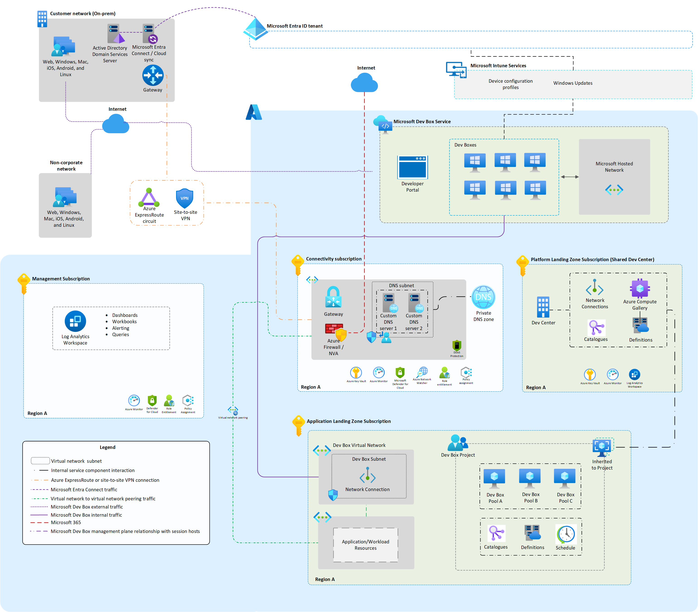

# Single Region Secure Baseline Dev Box Implementation

In this scenario, a [Dev Center](https://learn.microsoft.com/azure/templates/microsoft.devcenter/devcenters) and [Dev Center project](https://learn.microsoft.com/azure/templates/microsoft.devcenter/projects), along with the requisite components supporting use of Microsoft Dev Box, are deployed within a single region. This follows the [Azure Landing Zone architecture](https://learn.microsoft.com/azure/cloud-adoption-framework/ready/landing-zone/#azure-landing-zone-architecture) as illustrated in the diagram below.



*Download the Visio diagram for this architecture [here](../../diagrams/devbox-accelerator-diagrams.vsdx).*

The subset of components being provisioned in this example are presented as part of a broader set of subscriptions and resources to provide context on their placement within the overall [Azure Landing Zone architecture](https://learn.microsoft.com/azure/cloud-adoption-framework/ready/landing-zone/#azure-landing-zone-architecture).

## Core Architecture Components

The relevant subset of components from the diagram (above) are typically deployed across two subscriptions; a platform and a workload/app subscription.

### Platform Subscription

Shared services subscription hosting platform team capabilities.

Key resources being deployed / configured:

- **Dev Center**
  - Log Analytics workspace
  - Dev Box image definitions

### Workload/app Subscription

Workload subscription where application and/or project specific resources are deployed.

Key resources being deployed / configured:

- **Dev Center Project**
  - Networks/connections
  - Dev Box Pools

## Automated Deployment

The following sample JSON configuration files can be used as a starting point for this scenario.

- [dev-center-contoso.sample.json](../../src/dev-center/config/dev-center-contoso.sample.json)
- [dev-project-contoso.sample.json](../../src/dev-project/config/dev-project-contoso.sample.json)

### Deployment Steps

Refer to the main [read me](../../README.md) for instructions on [deploying reference implementations](../../README.md#deploying-reference-implementations). Scenario specific steps are described below along with CLI commands for convenience.

#### Dev Center Deployment

No additional mandatory steps. Dev Center deployment CLI command assuming ```src > dev-center``` as the current directory:

```azurecli
./deploy.sh -c config/<your_dev_center_configuration>.json -s <target_subscription_id>
```

#### Dev Project Pre-deployment

1. Refer to the JSON file output by the prerequisite [dev center deployment](#dev-center-deployment). This is output to the same folder as the configuration file being referenced using the same filename with an ```output``` suffix. This contains the requisite ```devCenterId``` value for use in the dev center project configuration.

1. If you have not done so already, update your Dev Center project configuration file to include your own values for the ```devCenterId``` along with the **Resource ID** values where any other existing resource is being referenced.

1. **[OPTIONAL]** As a starting point, the sample configuration makes use of the Microsoft hosted network. However, it's likely organizations will want to use their own networks similar to the conceptual architecture illustrated above. You can modify the starting point provided by [dev-project-contoso.sample.json](/src/dev-project/config/dev-project-contoso.sample.json) to use an existing unmanaged network instead (or deploy one as part of the automation). To make use of an existing network:

    - Reference the existing network within the ```networks``` section of the Dev Center Project configuration

        ```json
        "networks": [
          {
            "type": "Reference",
            "name": "my-referenced-network",
            "subnetId": "{resource_id_for_subnet}"
          }
        ]
        ```

    - Update the Dev Box Pool(s) providing an explicit ```networkName``` value

        ```json
        "pools": [
          {
            "name": "contoso-pool-a",
            "displayName": "Contoso Pool A",
            "definition": {
              "name": "VS2022EntBox"
            },
            "settings": {
              "enableLocalAdmin": false,
              "enableSingleSignOn": false
            },
            "networkName": "my-referenced-network"
          },
        ]
        ```

#### Dev Project Deployment

No additional mandatory steps. Dev Center deployment CLI command assuming ```src > dev-project``` as the current directory:

```azurecli
./deploy.sh -c config/<your_dev_center_project_configuration>.json -s <target_subscription_id>
```
